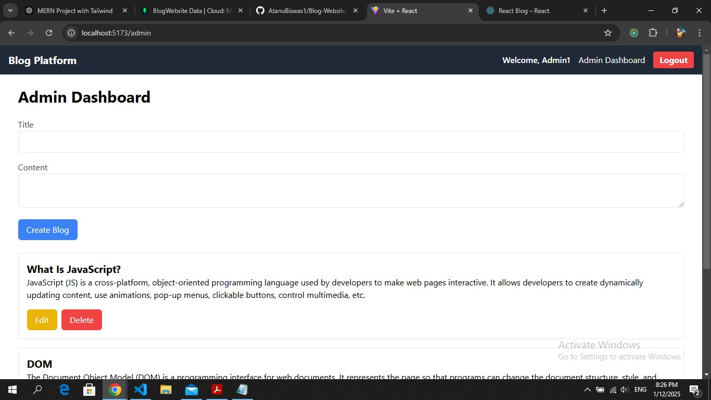

# **MERN Blog Application**

A full-stack blog application built with the MERN (MongoDB, Express, React, Node.js) stack. This application allows users to register, log in, view blogs, and for admins to create, update, and delete blogs.

---

## **Features**

### **Frontend**
- User authentication (Login/Signup) using JWT.
- Protected routes for users and admins.
- Dynamic blog viewing for logged-in users.
- Admin dashboard for managing blogs (CRUD operations).
- Built with:
  - **React**
  - **Redux Toolkit**
  - **Tailwind CSS**
  - **React Router DOM**

### **Backend**
- User authentication and authorization.
- Token-based role management (Admin/User).
- CRUD operations for blogs.
- RESTful API design.
- Built with:
  - **Node.js**
  - **Express.js**
  - **MongoDB**
  - **Mongoose**

---

## **Screenshots**

### Home Page


### Login Page


### Registration Page


### =============================


### Admin Dashboard



### Open Blog in new page


<!-- Replace the above URLs with actual links to your screenshots hosted on platforms like [Imgur](https://imgur.com/) or GitHub itself. -->

---

## **Folder Structure**

## **Backend Setup**

1. **Navigate to the `backend` folder**:
    ```bash
    cd Backend
    ```

2. **Install dependencies**:
    ```bash
    npm install
    ```

3. **Create a `.env` file**:
    In the root of the `backend` folder, create a `.env` file with the following content:
    ```plaintext
    MONGO_URI=your_mongo_db_uri
    JWT_SECRET=BlogForInternship12345678
    PORT=8000
    ACCESS_TOKEN_EXPIRY=1d
    ```
    Replace `your_mongo_db_uri` and `your_jwt_secret` with the actual MongoDB URI and a secret key for JWT.

4. **Start the server**:
    ```bash
    npm index.js
    or 
    "dev":"nodemon index.js"
    ```

---

## **Frontend Setup**

1. **Navigate to the `frontend` folder**:
    ```bash
    cd frontend
    ```

2. **Install dependencies**:
    ```bash
    npm install
    ```

3. **Start the development server**:
    ```bash
    npm run dev
    ```

---

## **API Endpoints**

### **User Routes**
API ='http://localhost:8000/api'

| Method | Endpoint              | Description               |
|--------|-----------------------|---------------------------|
| POST   | `${API}/auth/register`| Register a new user       |
| POST   | `${API}/auth/login`   | Log in a user             |

### **Blog Routes**

| Method | Endpoint              | Description               |
|--------|-----------------------|---------------------------|
| GET    | `${API}/blogs`          | Fetch all blogs           |
| POST   | `${API}/blogs`          | Create a new blog (Admin) |
| PUT    | `${API}/blogs/:id`      | Update a blog (Admin)     |
| DELETE | `${API}/blogs/:id`      | Delete a blog (Admin)     |

---

## **Key Functionalities**

1. **User Authentication**
    - JWT-based login and registration.
    - Persistent login using `localStorage`.

2. **Admin Dashboard**
    - Create, update, and delete blogs.
    - Secure access with role-based authentication.

3. **Dynamic UI**
    - Protected routes using `ProtectedRoute` and `AdminRoute`.
    - Conditional rendering based on authentication status.

---

## **Tech Stack**

- **Frontend**: React, Redux Toolkit, Tailwind CSS
- **Backend**: Node.js, Express.js, MongoDB
- **State Management**: Redux Toolkit
- **Authentication**: JWT

---

## **Contributing**

1. Fork the repository.
2. Create a feature branch:
    ```bash
    git checkout -b feature-name
    ```
3. Commit your changes:
    ```bash
    git commit -m "Add feature"
    ```
4. Push to the branch:
    ```bash
    git push origin feature-name
    ```
5. Open a pull request.

---

## **Clone the repository**
```bash
    https://github.com/AtanuBiswas1/Blog-Website-MERN-Project-Atanu-Biswas.git
```

## **License**

This project is licensed under the [MIT License](LICENSE).
